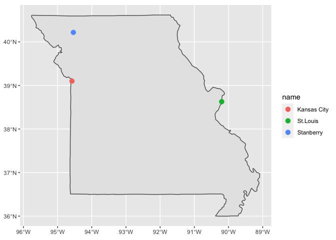

Yangyang Lyu
================

## Sleep time of one of my favorite animals

I like the elephants very much becasue they are smart, that we could
develop deep relationship with them. It is interesting to see how little
time they actually spend on sleeping, but the average lifespan of the
elephant is long in terms of animals’ lifespan.

``` r
Herbi <- msleep %>% 
 filter(name=="Asian elephant"|name=="African elephant")
Herbi
```

    ## # A tibble: 2 × 11
    ##   name    genus vore  order conservation sleep_total sleep_rem sleep_cycle awake
    ##   <chr>   <chr> <chr> <chr> <chr>              <dbl>     <dbl>       <dbl> <dbl>
    ## 1 Asian … Elep… herbi Prob… en                   3.9        NA          NA  20.1
    ## 2 Africa… Loxo… herbi Prob… vu                   3.3        NA          NA  20.7
    ## # … with 2 more variables: brainwt <dbl>, bodywt <dbl>

## Three cities with speical meaning to me

I spent one exchange year in the State, MO and these three cities are
meaningful to me. Stanberry is where I stayed for most of the times that
I lived there and also attended local school. Kansas City and St. Louis
are two important cities in MO and I went there for trips with my
friends.

<!-- -->
